# RCT Verdict Classifier

A single-page tool for classifying randomized clinical trial (RCT) results into **6 evidence classes** using the CI + MCID + Bayesian framework.

 

 

<h2 align="center"><a href="https://ihtanboga.github.io/rct-verdict-classifier/">Open Live Demo</a></h2>

 

---

## What it does

When a clinical trial reports *"HR 0.89, 95% CI 0.77–1.04, p = 0.14"*, the reflexive label is *"negative."* But is it truly negative, neutral, inconclusive, or underpowered? This tool answers that question using two complementary tracks:

1. **Frequentist track**: CI position relative to null and MCID thresholds
2. **Bayesian track**: Posterior probabilities under skeptical, optimistic, and pessimistic priors

## The 6 Classes

| Class | p | CI position | Bayesian signature |
|---|---|---|---|
| **Positive** | < 0.05 | Entire CI past MCID-benefit | Pr(MCID benefit) > 80% |
| **Imprecise (+)** | < 0.05 | Benefit side, crosses MCID | Pr(benefit) high, Pr(MCID) moderate |
| **Neutral** | ≥ 0.05 | Within ROPE, benefit excluded | Pr(ROPE) > 90% |
| **Negative** | ≥ 0.05 | Benefit excluded, extends beyond ROPE | Pr(MCID) ≈ 0, Pr(ROPE) ~80% |
| **Inconclusive / Underpowered** | ≥ 0.05 | Wide CI spans MCID zones | No probability dominates |
| **Harmful** | < 0.05 | Entire CI past MCID-harm | Pr(severe harm) > 40% |

### Key distinction: Negative vs Neutral

The most commonly confused pair. The tool uses **ROPE** (Region of Practical Equivalence, ±10%) to distinguish:

- **Neutral**: CI entirely within ROPE [0.91, 1.10] — *"treatments are the same"*
- **Negative**: CI above MCID-benefit but extends beyond ROPE — *"doesn't work, but not proven equivalent"*

## Framework Figures

### Decision Algorithm

### CI + MCID: 6 Classification Scenarios

### Three Faces of p > 0.05

### Negative vs Neutral

### Underpowered Trials

---

## Features

- **Multiple input formats**: HR, RR, OR with 95% CI; 2x2 event counts
- **7 preset examples**: DAPA-HF, EOLIA, ISCHEMIA, ORBITA, TOPCAT, ART, POST-PCI
- **CI + MCID forest plot** with color-coded zones (benefit, indifference, ROPE, harm)
- **Bayesian analysis** with 3 priors (Skeptical / Optimistic / Pessimistic)
- **Posterior density plot** with prior overlays
- **Full probability table**: Pr(benefit), Pr(MCID), Pr(ROPE), Pr(harm), Pr(severe harm)
- **Bayesian fingerprint matching** — checks if Bayesian profile agrees with frequentist verdict
- **Conditional educational figures** — framework SVG diagrams shown based on verdict
- **Downloadable HTML report** — self-contained, shareable
- **MCID validation** — prevents reversed thresholds
- **Zero dependencies** — single HTML file, runs entirely in the browser

## Quick start

1. Open `index.html` in any browser (or use the [live demo](https://ihtanboga.github.io/rct-verdict-classifier/))
2. Click a preset example or enter your own trial data
3. Click **Classify Trial**
4. Review the verdict, reasoning, Bayesian analysis, and figures
5. Download the report if needed

## Method

### Frequentist track (CI + MCID)

Based on Pocock & Stone (NEJM 2016) and Hawkins & Samuels (JAMA 2021):

1. Does CI exclude null? → If yes: Positive / Imprecise / Harmful
2. If not: Is benefit excluded (ciLower > MCID-benefit)?
3. If benefit excluded: Is CI within ROPE? → Neutral vs Negative
4. If benefit not excluded → Inconclusive / Underpowered

### Bayesian track (Zampieri/Harrell)

Conjugate normal-normal updating on log-ratio scale (Zampieri et al., AJRCCM 2021):

- **3 priors**: Skeptical N(0, 0.355²), Optimistic, Pessimistic
- **5 posterior metrics**: Pr(benefit), Pr(MCID benefit), Pr(ROPE), Pr(harm), Pr(severe harm)
- **Fingerprint matching**: Compares Bayesian probability profile to canonical class signatures
- **Prior sensitivity**: I² across posteriors

## References

- Zampieri FG, Casey JD, Shankar-Hari M, Harrell FE, Harhay MO. *AJRCCM*. 2021;203:543–552.
- Pocock SJ, Stone GW. *NEJM*. 2016;375:861–870.
- Hawkins AT, Samuels JD. *JAMA*. 2021;326:1875–76.
- Goligher EC et al. *JAMA*. 2018;320:2251–2259.
- Kruschke JK. *Adv Methods Pract Psychol Sci*. 2018 (ROPE).
- Altman DG, Bland JM. *BMJ*. 1995;311:485.
- Gelman A, Carlin J. *Perspect Psychol Sci*. 2014;9:641–651.

## Author

Prof. Ibrahim Halil Tanboga, MD, PhD — Nisantasi University Medical School

## License

MIT
